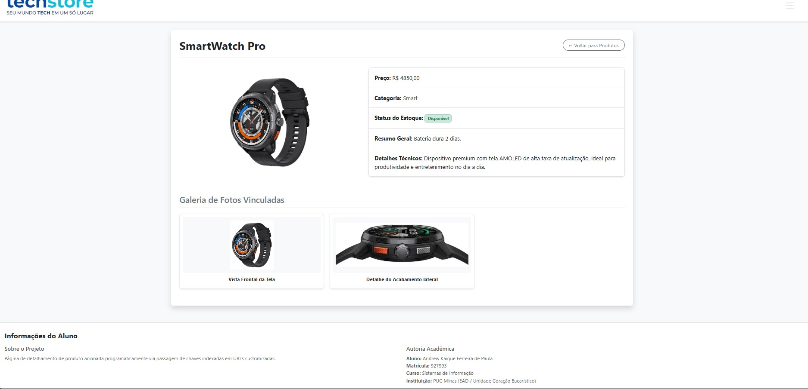
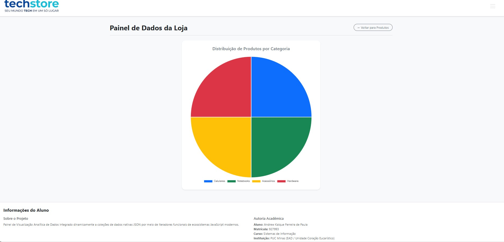

# ⚡ TechStore - E-commerce Dinâmico

Projeto prático desenvolvido para a disciplina de **Desenvolvimento Web** no curso de **Sistemas de Informação** na **PUC Minas**. A aplicação consiste em um mini e-commerce responsivo que consome dados estruturados em formato JSON para renderizar componentes de interface de forma 100% dinâmica via JavaScript e o framework Bootstrap 5.

---

## 👨‍💻 Dados do Aluno
* **Nome:** Andrew Kaique Ferreira de Paula
* **Matrícula:** 927993
* **Curso:** Sistemas de Informação
* **Instituição:** PUC Minas (EAD / Unidade Coração Eucarístico)

---

## 🚀 Funcionalidades Implementadas

1. **Vitrine Dinâmica (`index.html`):** Renderização de produtos e destaques via Vanilla JS a partir de um objeto JSON.
2. **Página de Detalhes (`detalhes.html`):** Passagem de parâmetros via Query String para exibição aprofundada de um item individual e galeria de fotos.
3. **Apresentação Dinâmica de Dados (`estatisticas.html`):** Implementação de um painel visual utilizando a biblioteca **Chart.js**. O script realiza a manipulação e o processamento dos dados estruturados em JSON, agrupando os produtos por categoria, e exibe as informações por meio de um gráfico de pizza responsivo e interativo.
4. **Navegação Lateral (Offcanvas):** Implementação de um menu hambúrguer dinâmico que lista todos os produtos do JSON em um componente *collapse*, facilitando o trânsito entre as páginas.

---

## 📸 Documentação Visual (Prints das Telas)

Abaixo estão as capturas de tela demonstrando o funcionamento da aplicação e a manipulação dos dados dinâmicos, conforme exigido pela Etapa 2 da atividade.

### 1. Home-page (`index.html`)
A página inicial apresenta a seção com os produtos em destaque utilizando o componente Carrossel e a listagem geral consumindo o JSON.

### 2. Página de Detalhes (`detalhes.html`)
Acessada dinamicamente ao clicar em um produto. Apresenta o layout personalizado individualmente com as especificações da entidade principal e a galeria de fotos vinculadas.

### 3. Apresentação Dinâmica com Chart.js (`estatisticas.html`)
Gráfico de Pizza gerado em tempo real, comprovando a leitura e agrupamento das categorias presentes no JSON. 

*(Abaixo, os dois prints obrigatórios exigidos pela Etapa 2, evidenciando a funcionalidade com dados manipulados/diferentes)*:

---

## 🛠️ Tecnologias e Bibliotecas Utilizadas
* **HTML5 e CSS3**
* **Vanilla JavaScript (ES6)**
* **Bootstrap 5** (Grid System, Cards, Carrossel, Offcanvas, Collapse)
* **Bootstrap Icons** (Ícones SVG)
* **Chart.js** (Renderização do Gráfico de Pizza)

---

## 📌 Versionamento e Tags (Git)
Este repositório seguiu o processo gradativo de desenvolvimento via commits e tags:
* `v1.0` - *chore: ambiente de desenvolvimento inicial do projeto*
* `v2.0` - *feat: add funcionalidade graficos dinamicos com Chart.js*
* `v3.0` - *docs: Alterações do README.md*