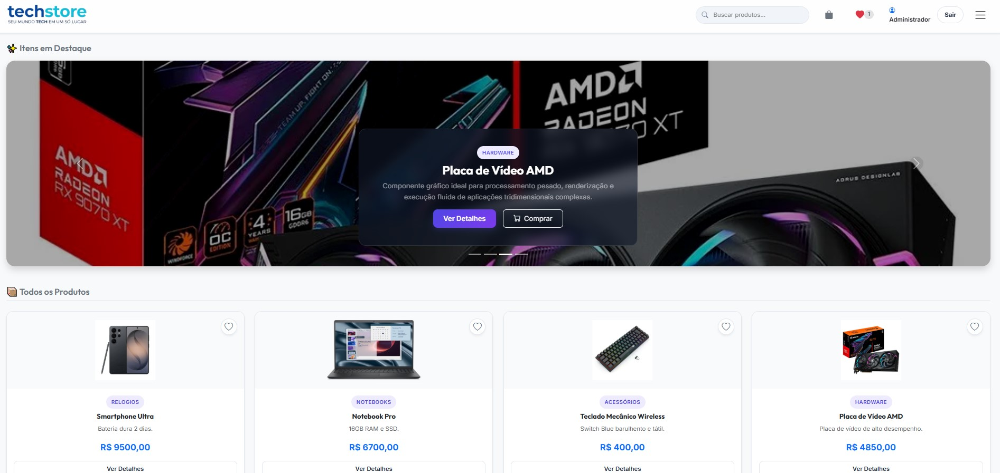
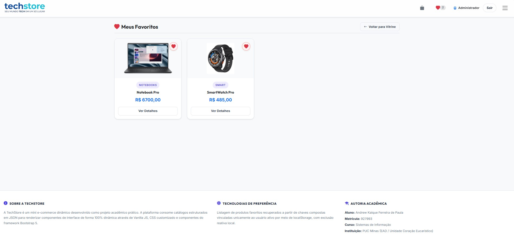
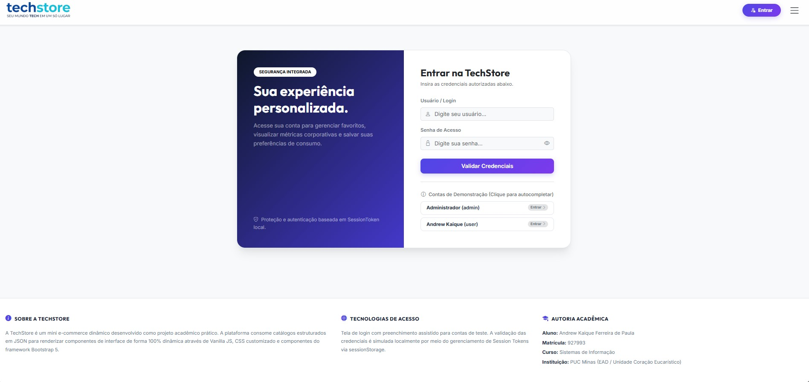

# ⚡ TechStore - E-commerce Dinâmico (Integração de Login e Personalização)

Projeto prático desenvolvido para a disciplina de **Desenvolvimento Web** no curso de **Sistemas de Informação** na **PUC Minas**. Esta etapa da aplicação foca na integração de um módulo de autenticação local e na implementação de funcionalidades de personalização por usuário, consumindo o ecossistema de Web Storage do navegador.

---

## 👨‍💻 Dados do Aluno
* **Nome:** Andrew Kaique Ferreira de Paula
* **Matrícula:** 927993
* **Curso:** Sistemas de Informação
* **Instituição:** PUC Minas Barreiro

---

## 🚀 Funcionalidades Implementadas

A aplicação consiste em um mini e-commerce responsivo e dinâmico via Vanilla JS, agora atualizado com as seguintes implementações exigidas na atividade:

1. **Autenticação e Controle de Sessão (`sessionStorage`):** Módulo de login funcional validando os usuários estáticos. O estado da conexão é gerenciado pelo `sessionStorage`, e a interface de navegação (Navbar) responde dinamicamente renderizando o nome do usuário ativo (ex: "Olá, Andrew") ou o botão de "Entrar" para sessões anônimas. O logoff destroi a sessão adequadamente.
2. **Personalização - Lista de Favoritos (`localStorage`):** Adição de regra de negócio que permite ao usuário conectado marcar e desmarcar produtos como favoritos. Os itens são armazenados no `localStorage` por meio de uma chave relacional e composta (`favoritos_<id_do_usuario>`), garantindo que os dados não se misturem entre contas diferentes na mesma máquina.
3. **Página Exclusiva de Favoritos:** Criação da view `favoritos.html`, com bloqueio de rota para visitantes (anônimos são redirecionados para a tela de login), que recupera os IDs persistidos e lista apenas os cards escolhidos pelo usuário.
4. **Renderização Dinâmica do Catálogo:** Vitrine de produtos, carrossel de destaques e painel analítico (via Chart.js) preenchidos através da leitura de arrays de objetos estritamente padronizados via JS, sem necessidade de JSON Server para esta etapa.

---

## 📸 Documentação Visual (Prints Obrigatórios da Atividade)

Abaixo estão as evidências do funcionamento das funcionalidades implementadas, conforme checklist do professor.

### 1. Home mostrando usuário logado
Tela inicial evidenciando que a sessão foi validada e a Navbar foi alterada via manipulação de DOM para refletir o nome do usuário corrente.

### 2. Página "Meus Favoritos"
Tela isolada exibindo apenas os itens que foram devidamente persistidos e salvos na chave do usuário ativo (provando a persistência por usuário exigida).

### 3. Página "Meus Favoritos"
Tela de login do usuário /admin.

---

## 🛠️ Ferramentas e Tecnologias Empregadas
* **HTML5 e CSS3** (Customização visual dedicada)
* **Vanilla JavaScript (ES6)** (Lógica, Iteradores de Array e Manipulação de DOM)
* **Web Storage API** (`sessionStorage` e `localStorage`)
* **Bootstrap 5** (Componentes de interface, Offcanvas e Modais)
* **Bootstrap Icons** (Simbologia vetorial)

---

## ⚙️ Como Executar a Aplicação
1. Realize o clone deste repositório em sua máquina local.
2. Abra a pasta do projeto em seu editor de código (como o Visual Studio Code).
3. Utilize uma extensão como o *Live Server* ou abra o arquivo `index.html` diretamente em seu navegador preferido.
4. Para testar o sistema de persistência, acesse `login.html` e valide a entrada com as credenciais padrão:
   * **Login:** `admin` | **Senha:** `123`
   * **Login:** `user` | **Senha:** `123`

---

## 📌 Checklist de Entregáveis Concluído
- [x] Login funciona e redireciona corretamente para a home.
- [x] Usuário logado é obtido via `sessionStorage` e usado na interface (UI).
- [x] Funcionalidade adicional de favoritos funciona somente para usuário logado.
- [x] Persistência por usuário está funcionando em `localStorage` com chave composta (ao atualizar a página, continua).
- [x] Há uma página/área que permite visualizar/gerenciar os favoritos.
- [x] Códigos organizados (funções bem separadas e legíveis).